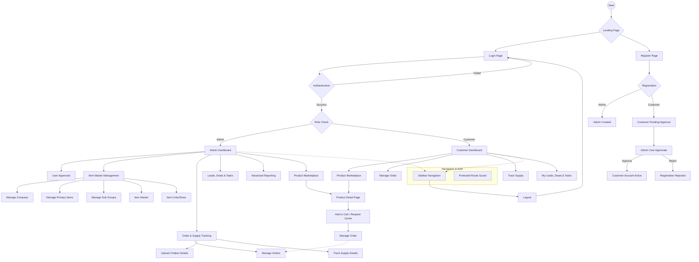
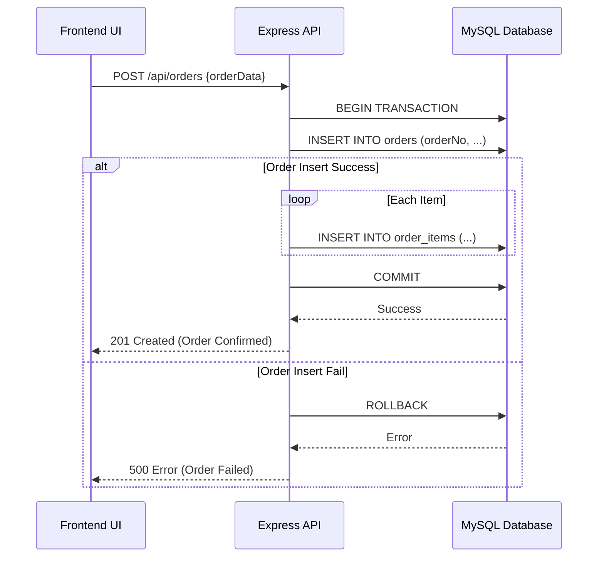
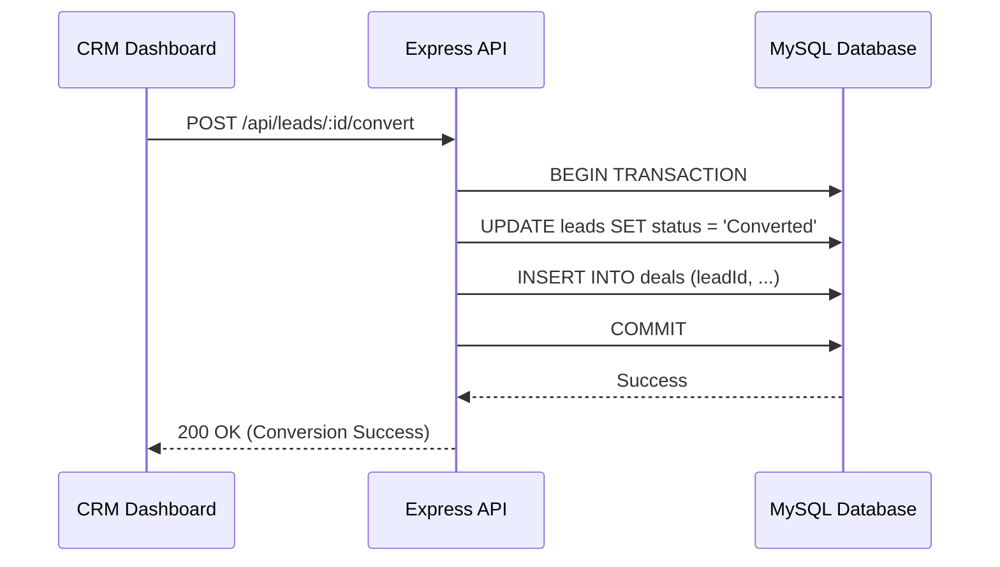

# MACO ERP Project Flow Diagram

This document provides a high-level overview of the MACO ERP system's architecture and user workflows.

## System Overview

The MACO ERP is a MERN-stack application (MongoDB, Express, React, Node.js) designed for enterprise resource planning, industrial marketplace management, and CRM.

## Core Workflows

## Data Insertion & Transaction Flow

The system ensures data integrity through structured workflows and database transactions.

### 1. Order Creation Transaction
When a customer or admin places an order, the system executes a multi-table transaction to ensure either all data is saved or none of it is (Atomicity).

### 2. Lead to Deal Conversion
The CRM module uses transactions to convert a lead into a deal, maintaining the link between the two entities.

### 3. User Registration & Approval
Data flow for user onboarding:
- **Phase 1 (Insertion)**: User data is inserted into the `users` table with `status = 'pending'`.
- **Phase 2 (Update)**: Admin reviews the record and performs a `PATCH` request to update `status = 'approved'`.
- **Phase 3 (Activation)**: The login logic checks the `status` field before issuing a JWT token.

## Database Interaction Patterns

| Feature | Pattern | Tables Involved |
| :--- | :--- | :--- |
| **Master Data** | Direct Insert/Update | `companies`, `primary_items`, `products`, `item_units` |
| **Orders** | ACID Transaction | `orders`, `order_items` |
| **CRM** | Linked Transaction | `leads`, `deals` |
| **Logistics** | Batch Processing | `supply_challans`, `supply_details` |
| **Security** | Role-Based Access | `users` |

## Key Components

### 1. Authentication & Security
- **JWT-based Auth**: Secure communication between frontend and backend.
- **Protected Routes**: React component guards that restrict access based on user roles (`admin` vs `customer`).
- **Approval System**: New customers must be approved by an administrator before gaining full access.

### 2. Administrator Module
- **Master Data Management**: Comprehensive controls for defining the organization's product hierarchy (Primary Items -> Sub Groups -> Item Master).
- **Logistics**: Tools for managing challans and tracking supply chains.
- **Reporting**: Data visualization and exports for business analysis.

### 3. Customer Module
- **B2B Marketplace**: A professional catalog for browsing industrial products with full specifications.
- **Order Lifecycle**: Workflow for adding items to cart, managing orders, and tracking deliveries.
- **CRM Integration**: Customers can view and manage their specific leads and tasks.

### 4. Shared Infrastructure
- **Common Components**: Modular UI elements like `Sidebar`, `Layout`, and `PageHeader`.
- **Database (MongoDB)**: Centralized storage for products, users, orders, and CRM data.
- **Express Backend**: RESTful API endpoints for data persistence and business logic.
